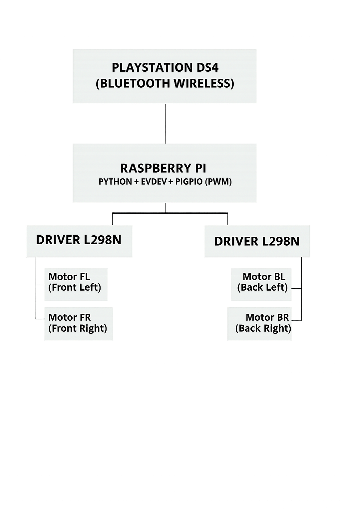

<h1 style="margin: 0;">
  
</h1>

Nuestro carrito **omnidireccional** que se controla con un mando de PS4 vía **Bluetooth**

---
## Descripción:

Este proyecto consiste en la construcción y programación de un **carrito omnidireccional** controlado por una **Raspberry Pi 4.** Gracias a las ruedas mecanum/omnidireccionales, el vehículo puede desplazarse en **cualquier dirección** sin necesidad de girar. El control del movimiento se realiza mediante un **mando inalámbrico de PlayStation 4 (DualShock 4)** conectado a la Raspberry Pi vía **Bluetooth.**

El software está desarrollado en **Python,** aprovechando librerías para la lectura del mando y control PWM de los motores.

---

## Características Principales 🎮

- Movimiento **360°** gracias a ruedas mecanum/omnidireccionales.
- Control remoto con **PS4 DualShock** vía Bluetooth.
- Raspberry Pi 4 como cerebro del sistema.
- Código en **Python** modular y fácil de expandir.
- Control de velocidad y dirección con los joysticks.

---

## Controles del mando PS4 🕹️

| Control | Acción |
| :-----: | :---:  |
| Joystick izquierdo| Movimiento del eje izquierdo |
| Joystick derecho | Movimiento del eje derecho |
| Gatillo izquierdo (L2) | Función lateral izquierda | 
| Gatillo derecho (R2) | Función lateral derecha    
Option & Share | Apagar Raspberry de forma segura |

---

## Hardware utilizado ⚙️

| Componente | Función |
| :-----: | :---:  |
| Raspberry Pi 4 (2GB/4GB) | Control principal / procesamiento |
| 4 Ruedas Mecanum | Movimiento omnidireccional |
| 2 Driver L298N | Control de motores DC | 
| 4 Motores DC | Tracción individual por rueda |    
| Control PS4 DualShock 4 | Control de movimiento vía BT |
| Batería recargable | Fuente de energía para motores |
| Chasis personalizado (Madera) | Soporte estructural |

---

## Arquitectura del sistema 🧠

  

---

## Futuras mejoras 👾

- 📌 Control vía app móvil

- 📌 ROS (Robot Operating System)

- 📌 Telemetría y streaming de cámara

- 📌 Autonomía parcial (sensores ultrasonido/LiDAR)

- 📌 Path planning con IA ligera

---

## Licencia 📜

Copyright (c) 2025 Josue

